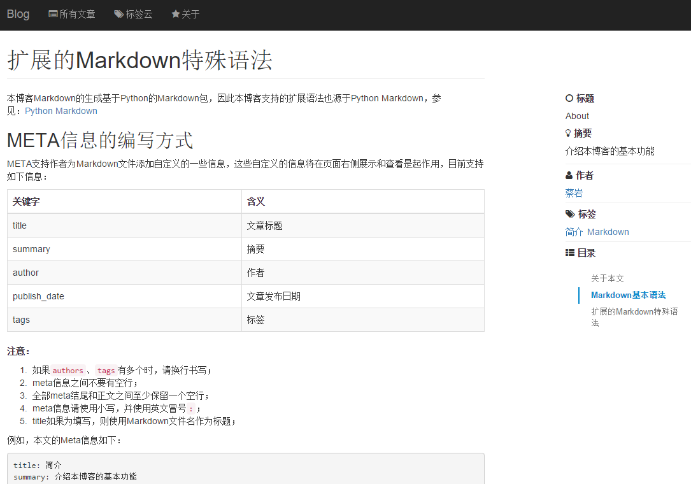

# 简介

本工程是一个基于[Flask](http://flask.pocoo.org/)和[Python Markdown](https://pythonhosted.org/Markdown/)开发的简易博客。
本博客支持基本的Markdown语法，并且支持table和Meta信息，具体参见[About.md](in/About.md)

# 工程依赖包安装

本工程主要依赖于Flask、Jinja2，具体参见requirement.txt

    pip install -r requirements.txt

# 基本用法

 0. Python环境搭建及依赖包安装，依赖包参见`requirements.txt`；
 1. 将你写好的.md文件丢到`generate.py`中`INPUT_CONTENT`所配置的目录中，默认为`./in`目录；
 2. 运行`generate.py`文件，生成html页面文件和索引文件；
 3. 运行`blog.py`文件，启动flask网站，用以对外提供访问html文件；
 4. 访问`http://127.0.0.1:5000/api/index/generate/`生成索引文件；
 5. 访问`http://127.0.0.1:5000/upload/`上传你编写好的md文件（md文件名请使用英文字母、数字、中划线、下划线的组合）；

# 工程结构简介

    blog
    ├─start.sh          -- linux启动脚本
    ├─stop.sh           -- linux停止脚本
    ├─start.bat         -- windows启动脚本
    ├─blog.py           -- flask工程主文件
    ├─generate.py       -- Markdown生成html工具
    ├─ReadMe.md         -- 本文档
    ├─requirements.txt  -- 依赖包
    ├─settings.py       -- flask 配置
    │
    ├─api           -- 数据查询接口
    ├─in
    │  └─About.md   -- 博客撰写方法说明
    │
    ├─static        -- 静态资源文件夹
    │  ├─favicon.ico
    │  ├─css
    │  ├─font
    │  ├─fonts
    │  └─js
    ├─templates     -- html模板
    └─utils         -- 工具类
    

# 示例

